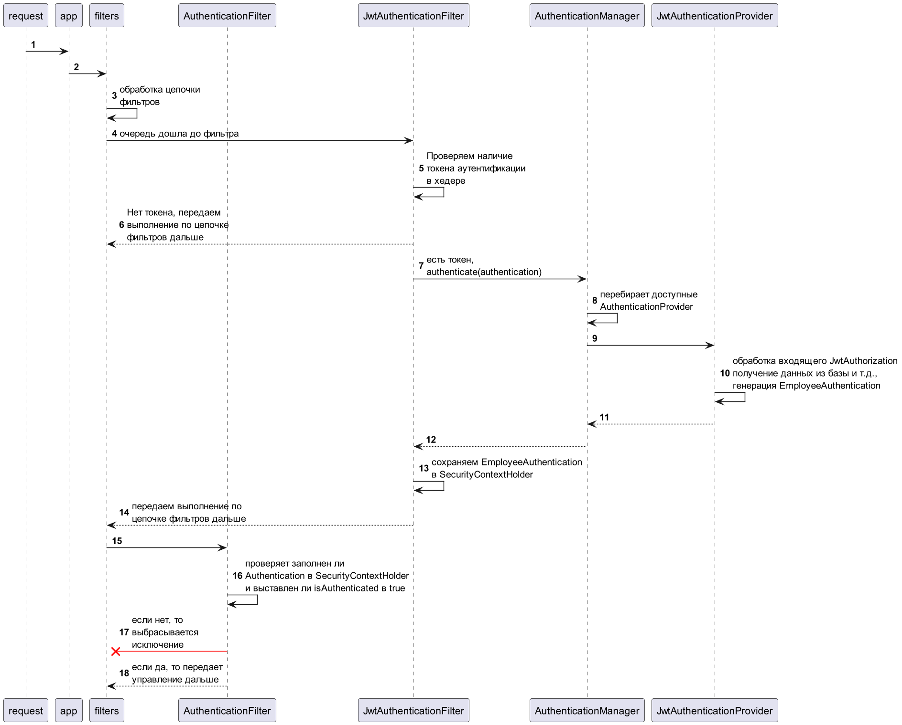

# Описание

Задача: взять из хедера входящего запроса токен, получить из него логин. По логину осуществить аутентификацию и авторизацию пользователя.

Базовая реализация, тут нет работы с JWT-токеном, нет обращения к базе данных или стороннему сервису за ролями для пользователя. 
Целью было разобраться с базовой функциональностью Spring Security и проверить работу Method Security.

# Классы

**SecurityConfiguration** - конфигурационный класс. 
- настроены открытые эндпоинты - один для целей тестов и эндпоинты актуатора
- отключены ненужные в нашем случае фильтры, связанные с логином и перенаправлениями
- отключен анонимный доступ
- отключен контроль csrf (для нашей схемы работы он не имеет смысла)
- отключаемые настройки CORS
- демо реализации кастомизации ответов о 401 и 403
- добавлен фильтр аутентификации
- создан бин ProviderManager

**JwtAuthentication** - класс служит для аутентификации через механизмы Spring Security. 
В него мы кладем полученный из хедера логин и передаем JwtAuthentication в AuthenticationManager для аутентификации.

**JwtAuthenticationFilter** - фильтр, расширяющий OncePerRequestFilter. 
Через SecurityConfiguration встраивается в цепочку фильтров Spring Security.
Его задача - обнаружить авторизационный хедер во входящем запросе, извлечь оттуда логин и вызвать AuthenticationManager для аутентификации. 
В случае успешной аутентификации помещает полученный объект Authentication в SecurityContextHolder.
Есть базовые реализации классов-фильтров аутентификации, предназначенные для переиспользования или расширения.
Например: AbstractAuthenticationProcessingFilter
Но я не смог найти реализацию, которая меня удовлетворила бы полностью.

**JwtAuthenticationProvider** - реализация AuthenticationProvider. Сюда должен попасть JwtAuthentication.
В этом классе происходят все действия по заполнению аутенцированного класса EmployeeAuthentication.
Например, тут мы возьмем из базы нашего пользователя и получим из сторонней системы его роли.
При ошибке будет выброшено исключение UsernameNotFoundException.

**SampleController** и **SampleControllerImpl** - интерфейс рест-контроллера и его реализация.
Сделано с целью проверить, как будут работать методы @PreAuthorize на @Override-методах.
Все работает как надо.

**CorsProperties** - класс для загрузки пропертей CORS из настроек приложения

**Employee** - pojo-класс "Сотрудник"

# Запросы для ручного тестирования

См. файл `test_calls.http`

Тесты Spring Boot не реализованы.

## Как это работает

[Spring Security - архитектура приложения на базе сервлета](https://docs.spring.io/spring-security/reference/servlet/architecture.html)

`Authentication_authorization.puml`

